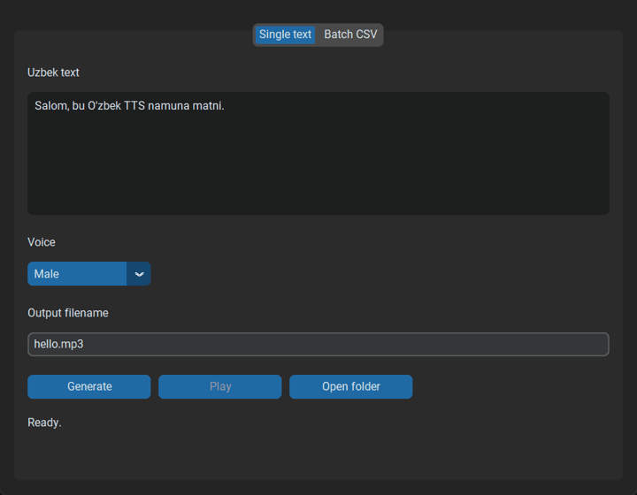
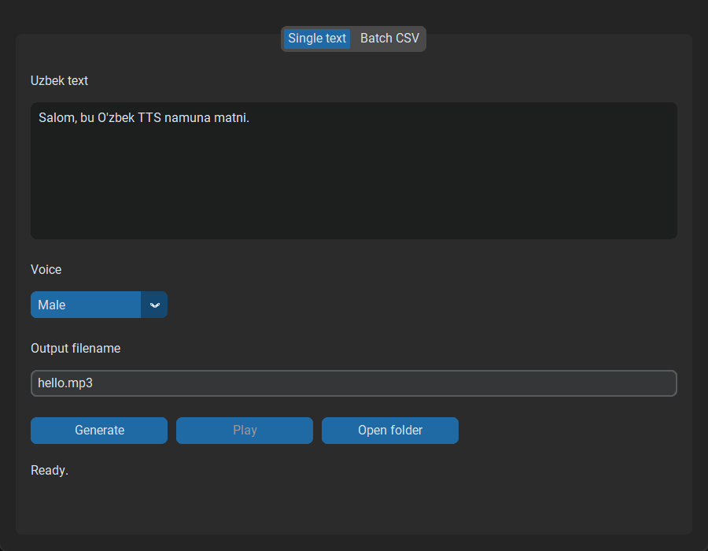
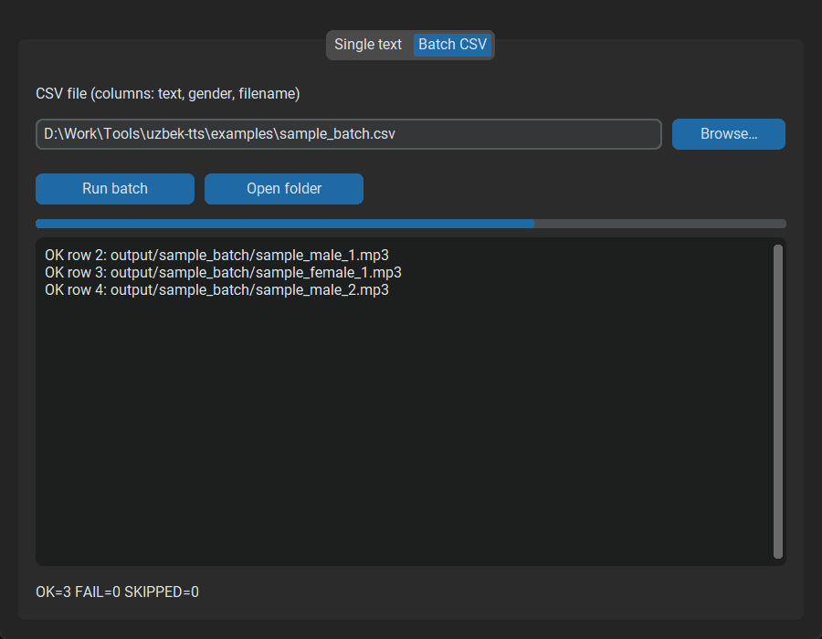
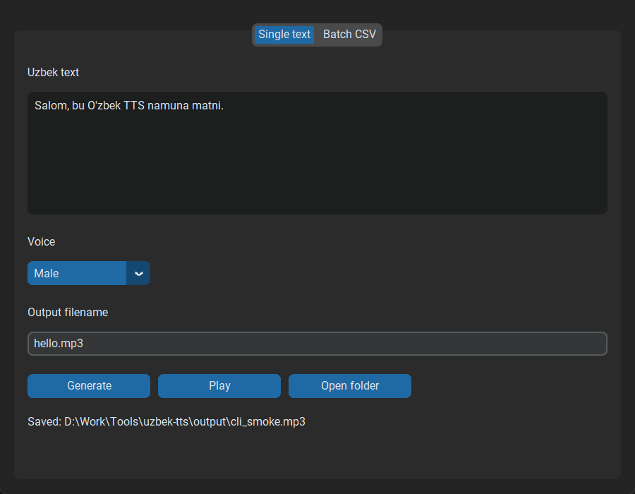

# Uzbek Voice Generator

> Generate natural Uzbek speech from text with male and female voices and export it as MP3.

Uzbek Voice Generator is a free Windows desktop application for turning Uzbek text into spoken audio. Choose a male or female voice, generate a single clip or a batch from CSV, and save the result as MP3. An internet connection is required (speech is generated online).

## Demo



Enter Uzbek text, select a voice, and generate MP3 audio directly from the desktop application.

| Single text | Batch CSV |
| --- | --- |
|  |  |



## Voice Samples

> TODO: Voice samples will be added in a future update.

Male and female Uzbek voice examples will appear here once sample audio is published.

## Download

Download the latest Windows executable from the [GitHub Releases](https://github.com/ludioo/Uzbek-Voice-Generator/releases) page.

1. Open **Releases** and download **`UzbekTTS.exe`**.
2. Put it in any folder and double-click.
3. Typical download size: about **16 MB**.

If Windows SmartScreen appears (“Windows protected your PC”), choose **More info → Run anyway** when you trust the release. Unsigned PyInstaller builds commonly trigger this.

Most users should use the `.exe`. Developers who want to run from source can follow [Run from source](#run-from-source) below.

## Features

* 🇺🇿 Uzbek text-to-speech
* 👨 Male Uzbek voice
* 👩 Female Uzbek voice
* 🎧 MP3 output
* 📄 Batch generation from CSV
* 🖥️ Windows desktop GUI
* 🆓 Free — no API key required

## Quick start

1. Download and open **`UzbekTTS.exe`**.
2. Enter Uzbek text (or switch to **Batch CSV**).
3. Choose **Male** or **Female**, set a filename, and click **Generate**.
4. MP3s are written next to the exe under `output/`. Use **Play** or **Open folder** afterward.

---

## Requirements

- Windows
- Python 3.12 (for source / CLI / building the exe)
- Internet connection (Edge TTS is online)

## Install (developers)

```powershell
python -m venv .venv
.\.venv\Scripts\Activate.ps1
pip install -r requirements.txt
```

Dev/build tools (pytest, PyInstaller):

```powershell
pip install -r requirements-dev.txt
```

## Run from source

```powershell
python -m venv .venv
.\.venv\Scripts\Activate.ps1
pip install -r requirements.txt
python gui_main.py
```

Or: `python main.py --gui`

Speech is produced with Microsoft Edge TTS (`edge-tts`). Male and Female voices are defined in `config/voices.json`.

## Tests

```powershell
pytest
```

Unit tests only; no live Edge TTS network calls are required.

## CLI

### Interactive (one file)

```powershell
python main.py
```

Enter Uzbek text, choose Male or Female, and set an output filename. The MP3 is written under `output/`. A bare basename like `hello` is enough — `.mp3` is added or normalized automatically.

### Batch from CSV

```powershell
python main.py --csv examples/sample_batch.csv
```

UTF-8 CSV must include columns `text`, `gender`, `filename` (exact names). Extra columns are ignored. Files saved from Excel as “CSV UTF-8” (with BOM) are supported.

Batch output goes under `output/<csv_stem>/` (from the CSV basename). Example: `examples/sample_batch.csv` → `output/sample_batch/*.mp3`. Interactive mode and GUI single-text still write directly under `output/`.

- `gender`: `1` = Male, `2` = Female only
- `filename`: required on every non-empty row (`.mp3` is normalized by the service)
- Quote `text` values that contain commas (standard CSV quoting)
- Failed rows are reported and skipped; the batch continues
- Existing files in the batch output folder are overwritten
- There is a 1 second delay after each non-skipped row
- Console shows per-row OK/FAIL and a final `OK=… FAIL=… SKIPPED=…` summary

See [`examples/sample_batch.csv`](examples/sample_batch.csv).

## Build the Windows `.exe`

```powershell
pip install -r requirements-dev.txt
pyinstaller uzbek_tts_gui.spec
```

Artifact: `dist/UzbekTTS.exe` (onefile, no console). When frozen, `config/voices.json` is bundled and `output/` is created beside the exe.

## Troubleshooting

- Empty text or invalid filename → clear message; use a simple basename like `hello` or `hello.mp3` (no folders or `..`). Wrong extensions (e.g. `.wav`) are normalized to `.mp3`.
- Batch CSV missing columns or unreadable file → process exits / aborts before generating audio.
- Network / TTS failure → check your internet connection and try again.
- Save permission failure → ensure the `output/` folder is writable.
- GUI logs appear at INFO and above when run from source; packaged exe surfaces failures via dialogs.

## Layout

- `gui_main.py` — GUI entry
- `main.py` — CLI (and `--gui`)
- `src/config/` — voice config loading
- `src/models/` — pure data models
- `src/providers/` — Edge TTS integration
- `src/services/` — generation orchestration
- `src/ui/` — CLI + CustomTkinter GUI
- `config/voices.json` — voice definitions
- `examples/` — sample batch CSV
- `assets/` — screenshots and demo GIF
- `output/` — generated MP3 files
- `uzbek_tts_gui.spec` — PyInstaller recipe

## Contributing

Issues and pull requests are welcome. Keep changes focused; run `pytest` before opening a PR.
